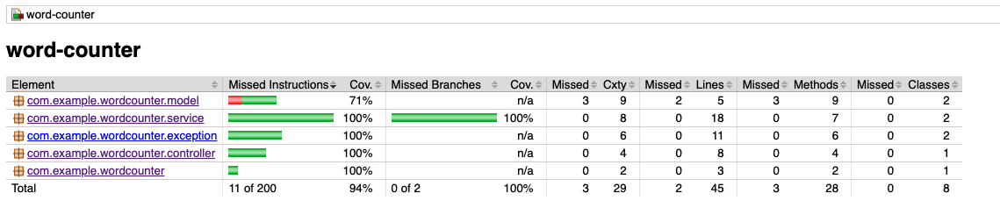

# word-counter

This microservice is for Word Counter".  It has following features
1. method to add words
2. method that returns the count of how many times a given word was added to the word counter
3. should NOT allow addition of words with non-alphabetic characters 
4. should treat same words written in different languages as the same word, for example if
adding "flower", "flor" (Spanish word for flower) and "blume" (German word for flower) the counting method should return 3.  You may assume that translation of words will be done via external class provided to you called "Translator" that will have method "translate" accepting word as an argument and it will return English name for it.


This microservice is developed using Spring Boot.

## Prerequisites
- Java
- [Spring Boot](https://spring.io/projects/spring-boot)
- [Maven](https://maven.apache.org/guides/index.html)
- [Lombok](https://objectcomputing.com/resources/publications/sett/january-2010-reducing-boilerplate-code-with-project-lombok)


## Tools
- Eclipse or IntelliJ IDEA (or any preferred IDE) with embedded Maven
- Maven
- Postman (or any RESTful API testing tool)


##  Build and Run application
_GOTO >_ **~/absolute-path-to-directory/word-counter**  
and try below command in terminal
> **```mvn spring-boot:run```** it will run application as spring boot application

or
> **```mvn clean install```** it will build application and create **jar** file under target directory

Run jar file from below path with given command
> **```java -jar ~/path-to-word-counter/target/word-counter-1.0.0-RELEASE.jar```**

Or
> run main method from `word-counterApplication.java` as spring boot application.

## Logging

**@Lombok** - Lombok is used for logging <br/>

## API Endpoints

- #### word-counter Microservice Endpoint
  > **Post Mapping** http://localhost:8080/word/add - Add new word
  Request Body
     ```
        {
           "word": "flower"
        }
     ```
  > **Post Mapping** http://localhost:8080/word/count- Count words
  Request Body
     ```
        {
           "word": "flower"
        }
     ```

## Swagger Endpoints
> **Swagger URL:** http://localhost:8080/swagger-ui/index.html#

> **api-docs:** http://localhost:8080/v3/api-docs/

## TDD Code Coverage


## Design Patterns Used
> The design patterns used are Model View Controller Pattern, FrontController Pattern, Factory Pattern

## Software Design Principles
> SOLID, DRY, KISS

## Clients to access this API 
> The best solution is to use an API gateway (Kong, IBM API Gateway etc), so all api's, endpoints and swagger documentations are available in a single market place.

## Service Hosting and Application in Production
> The recommended method is to create docker container of the word-counter microservice and deploy the container to a kubernetes cluster like AWS EKS/Azure AKS/Openshift for high availabilty, resilence and autoscaling. 


